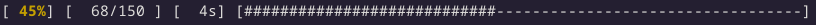

## Pbar

Add a simple progress bar or spinner to golang CLI.  
Light with no external dependencies.  
Does not support multilines.

```bash
go get github.com/ermineaweb/pbar
```

## Quick start

### Progress Bar



```golang
// progress bar with total tasks known
pb := pbar.NewDefaultPbar(len(tasks))

for _, task := range tasks {
    longWork(task)
    pb.Add(1)
}
```

#### Custom configuration

```golang
pbar := pbar.NewCustomPbar(
    pbar.ConfigPbar{
        TotalTasks:           uint64(tasks),
        Infos:                true,
        CharDone:             'o',
        CharTodo:             '-',
        ColorPercentWorking:  pbar.RED_BRIGHT,
        ColorPercentFinished: pbar.GREEN,
        ColorCharDone:        pbar.RED_BRIGHT,
        ColorCharTodo:        pbar.BLACK_BRIGHT,
    },
)
```

### Spinner


```golang
// spinner with total tasks unknown
sp := pbar.NewDefaultSpinner(pbar.ConfigSpinner{})

sp.Start()

// ... some work ...

sp.Stop()
```

#### Custom configuration

```golang
spinner := pbar.NewCustomSpinner(
    pbar.ConfigSpinner{
        Spinner:          pbar.SPINNER_ARROW,
        StartMessage:     "Let's work!",
        StopMessage:      "Job's done!",
        ColorSpinner:     pbar.RED_BRIGHT,
        ColorTimer:       pbar.BLUE_BRIGHT,
        AnimationDelayMs: 130,
    },
)
```
